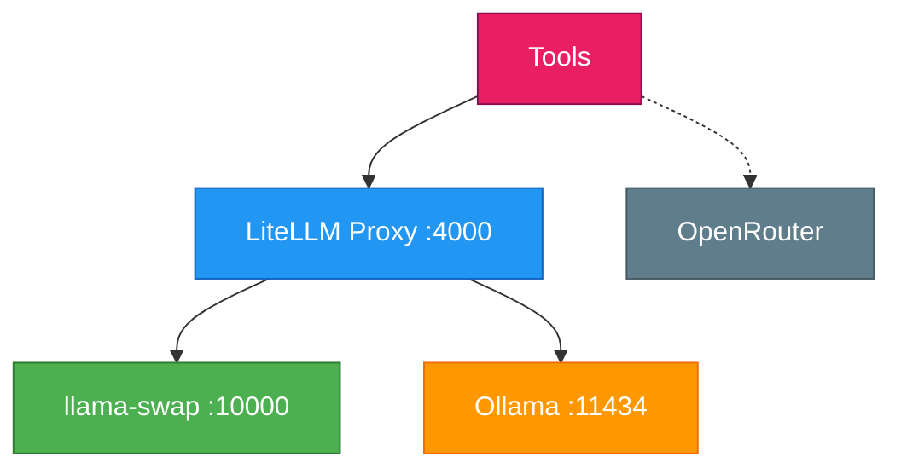

# Mermaid Theme: homelab-mesh

Material Design inspired color scheme for homelab inference architecture diagrams.

## Color Palette

| Element | Background | Border | Text |
|---------|------------|--------|------|
| LiteLLM Proxy | `#2196F3` | `#1565C0` | `#fff` |
| llama-swap (primary) | `#4CAF50` | `#2E7D32` | `#fff` |
| llama-swap (leaf) | `#9C27B0` | `#7B1FA2` | `#fff` |
| Ollama | `#FF9800` | `#EF6C00` | `#fff` |
| Cloud-only | `#F44336` | `#C62828` | `#fff` |
| OpenRouter | `#607D8B` | `#455A64` | `#fff` |
| Tools | `#E91E63` | `#880E4F` | `#fff` |

## Semantic Meanings

- **Blue (#2196F3)**: LiteLLM gateway/proxy layer (authentication, routing)
- **Green (#4CAF50)**: Primary llama-swap tiers (orchestration, research)
- **Purple (#9C27B0)**: Leaf tier llama-swap (ds9, enterprise on-demand models)
- **Orange (#FF9800)**: Ollama (embeddings, non-migrated models only)
- **Red (#F44336)**: Cloud-only machines with no local inference
- **Teal (#607D8B)**: External services (OpenRouter, OpenCode Zen)
- **Pink (#E91E63)**: Consumer tools (OpenCode, Crush, Hermes, etc.)

## Usage

### Inline styles (recommended for single diagrams)



### Class-based styling

```mermaid
flowchart TD
    classDef litellm fill:#2196F3,stroke:#1565C0,color:#fff
    classDef swap fill:#4CAF50,stroke:#2E7D32,color:#fff
    classDef ollama fill:#FF9800,stroke:#EF6C00,color:#fff
    classDef openrouter fill:#607D8B,stroke:#455A64,color:#fff
    classDef agents fill:#E91E63,stroke:#880E4F,color:#fff

    litellm["LiteLLM Proxy"]
    swap["llama-swap"]
    ollama["Ollama"]
    openrouter["OpenRouter"]
    agents["Tools"]

    class litellm,ds9_litellm,e_litellm litellm
    class swap,d_swap ds9_swap
    class ollama,d_ollama ds9_ollama ollama
    class openrouter openrouter
    class agents agents
```

### Edge styling

```mermaid
classDef default stroke-width:2px
```

## Pitfalls

- Use **inline styles** for single diagrams — easier to maintain and self-contained
- Use **class-based styling** when the same component appears in multiple diagrams
(e.g., `litellm` on discovery, ds9, enterprise)
- Always include `color:#fff` for colored backgrounds — ensures text readability
- Don't mix inline and class-based styling for the same node — pick one pattern
per diagram

## Related

- [`ARCHITECTURE.md`](https://github.com/isaackehle/homelab/blob/main/ARCHITECTURE.md) - Local Inference Routing section
- [`MODEL_STRATEGY.md`](https://github.com/isaackehle/homelab/blob/main/MODEL_STRATEGY.md) - Distributed fleet architecture

---

**Source:** `ARCHITECTURE.md` - Local Inference Routing section
